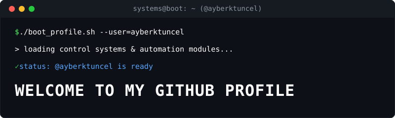

  

 

<table>
  <tr>
    <td width="55%" align="left" valign="middle">
      <h2>Ayberk Tuncel</h2>
      
<b>Electrical & Electronics Engineering | Control Systems & Automation</b>

      
<i>Dedicated to designing robust control architectures and developing advanced engineering software solutions.</i>

      

        <a href="https://www.linkedin.com/in/ayberk-tuncel/"><b>LinkedIn Profile</b></a>
      

      

        <!-- Devicon Stili İkonlar (Kutucuksuz ve temiz) -->
        
        
        
        
      

    </td>
    <td width="45%" align="center" valign="middle">
      
    </td>
  </tr>
</table>

---

### ⚙️ Professional Focus & Interests

I specialize in modern control engineering, dynamic system simulation, and algorithm development. My core technical areas include:
*   **Control Systems Design:** Implementing advanced strategies such as Linear Quadratic Integrator (LQI) and Gain Scheduling for optimal dynamic stabilization.
*   **System Modeling & Simulation:** Building robust state-space models and decision-making mechanisms using Simulink and Stateflow FSMs.
*   **Software Development:** Creating object-oriented programming solutions and automated data analysis interfaces.

---
